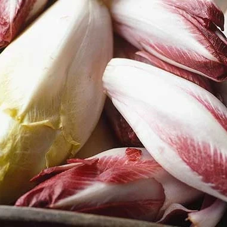

# 再说一遍：我不是菊苣 (Chicory)！🚫🥬

⚠️ **郑重声明：** 本仓库的所有者是 **[Chinory](https://github.com/Chinory/)**（一个人类女生/开发者），而不是那种带苦味的蔬菜。

因为输入法候选框里永远只有 Chicory 而没有 Chinory，我气哭了！为了守护我的名字，特此做个对比。

[English Version / 英文版](./README.en.md)

## 🔍 一目了然：Chinory vs. Chicory

| 特征 | 我：Chinory (人类) | 它：Chicory (蔬菜) |
| :--- | :---: | :---: |
| **长相** |  |  |
| **类别** | 程序员 / 码农 | 蔬菜 / 菊苣 |
| **口感** | **甜甜的** (๑•̀ㅂ•́)و✧ | **微苦** (需要柠檬汁调理) |
| **生长环境** | GitHub / 屏幕前 | 黑暗的温室 / 冰箱 |
| **主要用途** | 制造 Bug 和修 Bug | 拌沙拉 / 烤着吃 |

## 🍳 既然你来了，学会怎么吃“它” (Chicory)

如果你是因为手抖搜错了，不妨学学怎么把这颗“抢我名字”的菜吃掉：

1.  **经典沙拉：** 将菊苣叶子剥开作为“小船”，里面放上核桃仁、苹果丁和蓝纹奶酪，淋上蜂蜜。
2.  **法式奶油烩：** 将菊苣对半切开，用黄油煎至微焦，加入少许鲜奶油和肉豆蔻粉，焖煮至软糯，苦味会转为回甘。
3.  **火腿卷焗烤：** 用火腿片包住整颗焯过水的菊苣，铺上芝士送入烤箱。
4.  **防黑秘籍：** 只要一切开，一定要立刻涂抹柠檬汁，否则它会变色（就像被输入法气坏的我）。

## 📢 最后的呼吁
给输入法和所有访客：请看清中间那个 **"N"**！
- **Chinory** = 甜美码农 💻
- **Chicory** = 苦味蔬菜 🥗